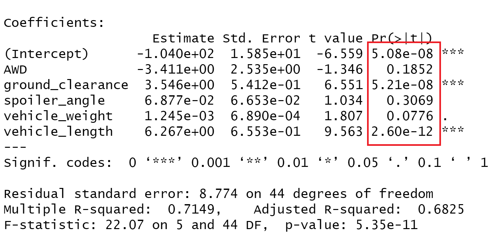
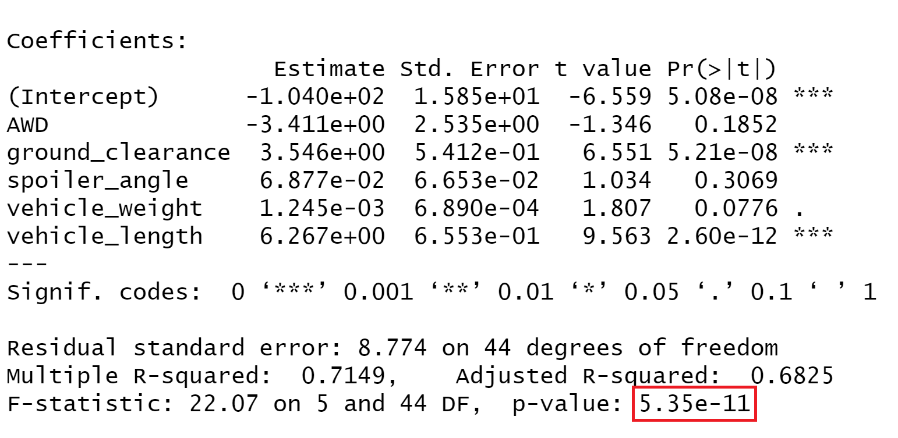
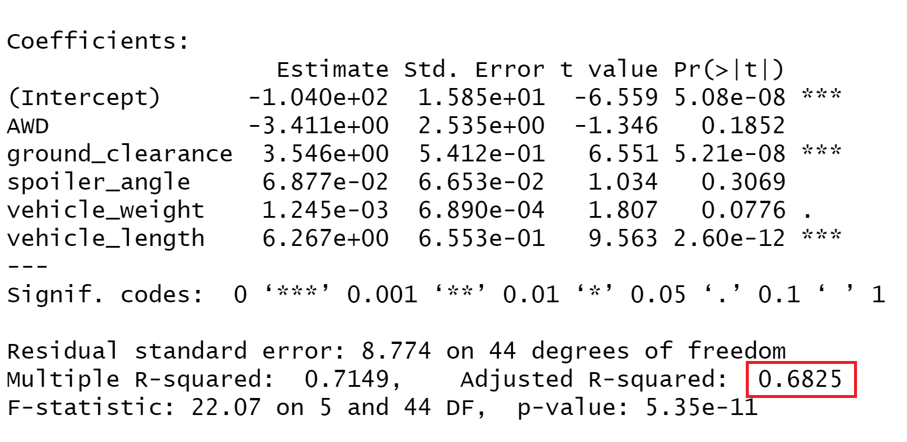
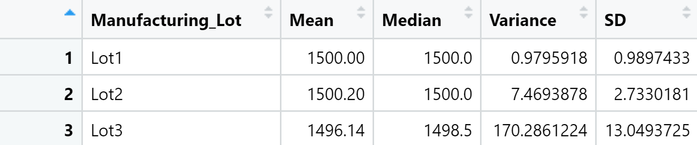
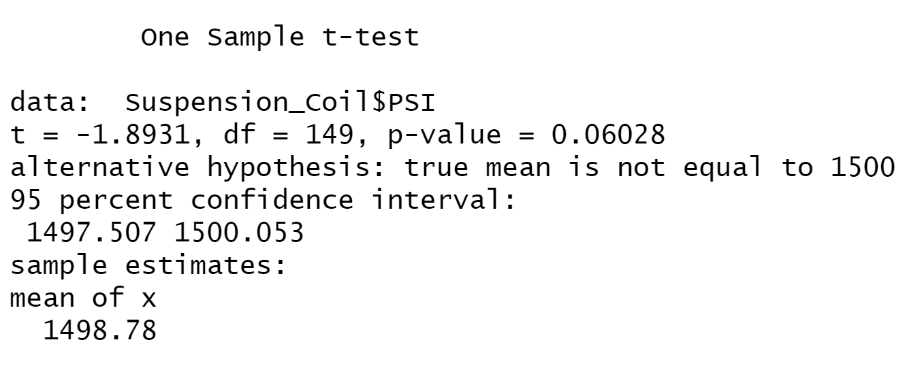
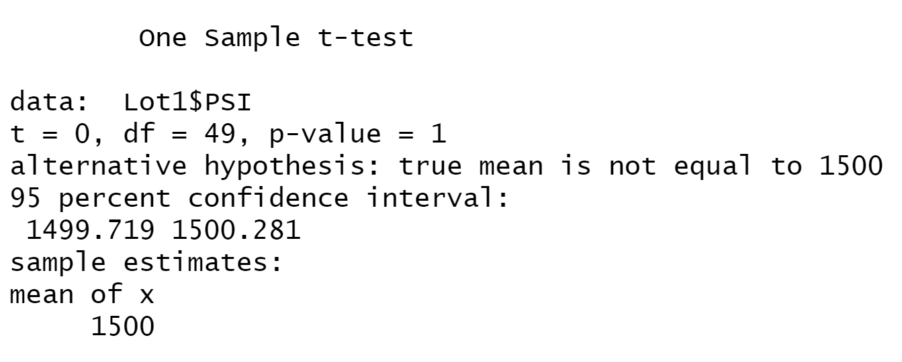
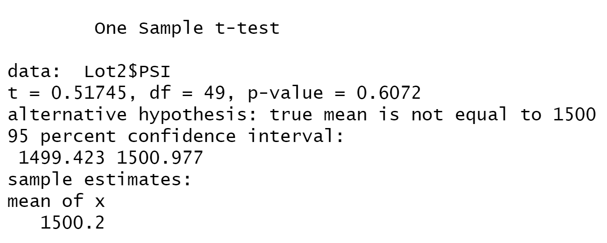
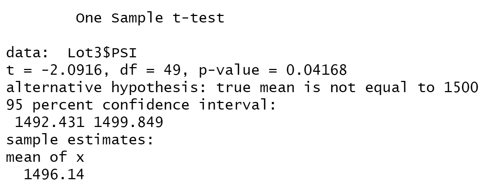

# MechaCar Statistical Analysis

## Linear Regression to Predict MPG

AWD, spoiler angle, and vehicle weight provided a non-random amount of variance to linear model, meaning they had a significant impact on mpg in this dataset. This can be understood by assessing the Pr(>|t|) values circled in red below. Values greater than 0.05 are statistically unlikely to contribute random variance to the model, while values less than 0.05 are statistically unlikely to contribute non-random variance to the model.

The slope of the model is not considered to be zero. Our null and alternative hypotheses were: 

H0 : The slope of the linear model is zero, or m = 0

Ha : The slope of the linear model is not zero, or m ≠ 0.

The p-value circled below in red is 5.35e-11, meaning the null hypothesis is rejected and the slope of the model is not zero.

The linear model predicts mpg of MechaCar prototypes effectively due to the R-squared value. I analyzed the adjusted R-squared (which some say is more accurate than the multiple R-squared) and with a value of 0.68, I concluded the linear model moderately predicts mpg of the MechaCar prototypes.

## Summary Statistics on Suspension Coils

The following table describes the mean, median, variance, and standard deviation of the suspension coil's PSI accross all lots.

The next able is the mean, median, variance, and standard deviation of PSI for each lot.

The design specifications for the MechaCar suspension coils dictate that the variance of the suspension coils must not exceed 100 pounds per square inch. The current manufacturing data indicates that the overall variance between lots doesn't exceed 100 PSI, however, the PSI variance in Lot 3 is 170 meaning Lot 3 does not meet this design specification.

## T-Tests on Suspension Coils
then briefly summarize your interpretation and findings for the t-test results. Include screenshots of the t-test to support your summary.
Using your knowledge of R, perform t-tests to determine if all manufacturing lots and each lot individually are statistically different from the population mean of 1,500 pounds per square inch

The mean PSI of combined lots does not statistically differ from the population mean of 1500 PSI. This statistical analysis was drawn by looking at the p-value of the t-test, which is 0.06 (as seen below). Therefore we fail to reject the null hypothesis of statistically equal means.

The mean PSI of Lot 1 does not statistically differ from the population mean of 1500 PSI. This statistical analysis was drawn by looking at the p-value of the t-test, which is 1 (as seen below). Therefore we fail to reject the null hypothesis of statistically equal means.

The mean PSI of Lot 2 does not statistically differ from the population mean of 1500 PSI. This statistical analysis was drawn by looking at the p-value of the t-test, which is 0.61 (as seen below). Therefore we fail to reject the null hypothesis of statistically equal means.

The mean PSI of Lot 3 statistically differs from the population mean of 1500 PSI. This statistical analysis was drawn by looking at the p-value of the t-test, which is 0.04 (as seen below). Therefore we reject the null hypothesis of statistically equal means.

## Study Design: MechaCar vs Competition

In order to further assess AutosRUs' newest prototype, the MechaCar, we are going to compare a variety of highly values car metrics to 3 competition car models. The following metrics will be tested: safety rating, city and highway efficiency, and horsepower. We will conduct this analysis using 4 one-way ANOVA tests. We will use ANOVA tests because they test the means of a single dependent variable across a single independent variable with multiple groups. The first ANOVA will test safety rating between each group, the second will test city MPG efficiency between each group, the third will test highway MPG efficiency between each group, and the last ANOVA will test horsepower between each group. The hypotheses are as followed:

H0 : The means of all groups are equal, or µ1 = µ2 = … = µn.

Ha : At least one of the means is different from all other groups.

We will need to collect all metric trial data from our competitors as well as conduct repeated trials of our own to assess the MechaCar for the desired metrics.

